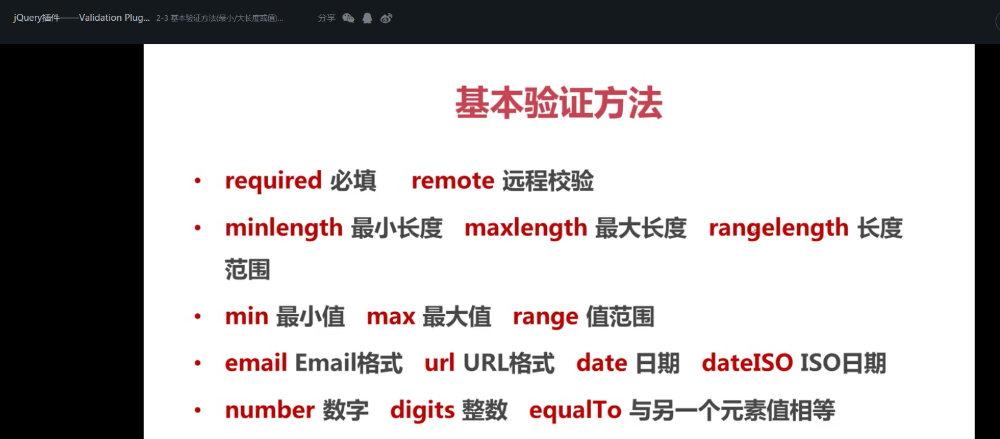
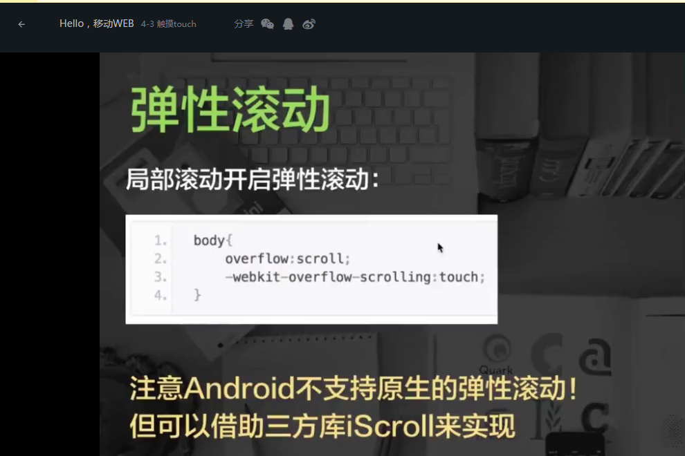
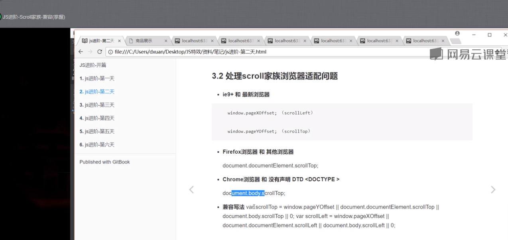

# mystudy
> this is my study!

# directory
## folder-name
<code><a href="#my-canvas">my-canvas</a></code>
<code><a href="#my-case">my-case</a></code>
<code><a href="#my-d3JS">my-d3JS</a></code>
<code><a href="#my-es6">my-es6</a></code>
<code><a href="#my-gulp">my-gulp</a></code>
<code><a href="#my-jquery">my-jquery</a></code>
<code><a href="#my-loading">my-loading</a></code>
<code><a href="#my-plugins-study">my-plugins-study</a></code>
<code><a href="#my-react">my-react</a></code>
<code><a href="#my-rem-layouts">my-rem-layouts</a></code>
<code><a href="#my-touch">my-touch</a></code>
<code><a href="#my-vue">my-vue</a></code>
<code><a href="#my-webpack">my-webpack</a></code>
<code><a href="#wx-domo">wx-domo(微信小程序)</a></code>
<code><a href="#my-spy-debugger">真机调试</a></code>
<code><a href="#my-nginx">nginx</a></code>
<code><a href="#my-json-server">my-json-server</a></code>
<code><a href="#my-javascript">my-javascript</a></code>

***

## folder-show
### my-canvas
<pre>
    > <a href="my-canvas/刮刮乐0.html">刮刮乐0.html</a>  
    > <a href="my-canvas/刮刮乐1.html">刮刮乐1.html</a>  
    > <a href="my-canvas/刮刮乐2.html">刮刮乐2.html</a>  
    > <a href="my-canvas/刮刮乐3.html">刮刮乐3.html</a>  
    > <a href="my-canvas/刮刮乐4.html">刮刮乐4.html</a>  
    > <a href="my-canvas/合成图片.html">合成图片.html</a>  
    > <a href="my-canvas/图形头像.html">图形头像.html</a>  
    > <a href="my-canvas/多边形.html">多边形.html</a>  
    > <a href="my-canvas/太极图.html">太极图.html</a>  
    > <a href="my-canvas/放大镜.html">放大镜.html</a>  
    > <a href="my-canvas/橡皮筋式选取框.html">橡皮筋式选取框.html</a>  
    > <a href="my-canvas/水印.html">水印.html</a>  
    > <a href="my-canvas/ball.html">ball.html</a>  
    > <a href="my-canvas/canvas时钟.html">canvas时钟.html</a>  
    > <a href="my-canvas/canvas_createImageData.html">canvas_createImageData.html</a>  
    > <a href="my-canvas/canvas_getImageData_putImageData.html">canvas_getImageData_putImageData.html</a>  
    > <a href="my-canvas/clip1.html">clip1.html</a>  
    > <a href="my-canvas/clip2.html">clip2.html</a>  
    > <a href="my-canvas/clip3.html">clip3.html</a>  
    > <a href="my-canvas/clip4.html">clip4.html</a>  
    > <a href="my-canvas/drapGrid.html">drapGrid.html</a>  
    > <a href="my-canvas/globalAlpha.html">globalAlpha.html</a>  
    > <a href="my-canvas/globalCompositeOperation.html">globalCompositeOperation.html</a>  
    > <a href="my-canvas/image.html">image.html</a>  
    > <a href="my-canvas/index.html" title="数码时钟">index.html</a>  
    > <a href="my-canvas/line.html">line.html</a>  
    > <a href="my-canvas/linearGradient.html">linearGradient.html</a>  
    > <a href="my-canvas/moon.html">moon.html</a>  
    > <a href="my-canvas/radialGradient.html">radialGradient.html</a>  
    > <a href="my-canvas/shadow.html">shadow.html</a>  
    > <a href="my-canvas/star.html">star.html</a>  
</pre>

### my-case
<pre>
demo
    > <a href="my-case/demo/dist/Html/Index.html" title="经过gulp处理">dist/Html/Index.html</a> 
    > <a href="my-case/demo/src/Html/Index.html" title="原始html">src/Html/Index.html</a> 

doubanAPI
    > <a href="my-case/doubanAPI/list.html">list.html</a>
    > <a href="my-case/doubanAPI/more.html">more.html</a>
    > <a href="my-case/doubanAPI/detail.html">detail.html</a>

my-jsonserver 
    > <a href="my-case/my-jsonserver/newlist.html">newlist.html</a>
    > <a href="my-case/my-jsonserver/newdetail.html">newdetail.html</a>
    > <a href="my-case/my-jsonserver/test.html">test.html</a>
    
    要使my-jsonserver(模拟REST API)的链接能显示内容，就要在cmd运行命令json-server db.json或者json-server news.js。
    
    json-server安装(cmd)
    * npm install json-server -g
    * npm install json-server --save-dev
    * npm install mockjs --save

Online Retailer 
    > <a href="my-case/Online Retailer/html/index.html">index.html</a>
    > <a href="my-case/Online Retailer/html/Agreement.html">Agreement.html</a>
    > <a href="my-case/Online Retailer/html/ShopCar.html">ShopCar.html</a>
    > <a href="my-case/Online Retailer/html/ShopClassify.html">ShopClassify.html</a>
    > <a href="my-case/Online Retailer/html/ShopCollection.html">ShopCollection.html</a>
    > <a href="my-case/Online Retailer/html/ShopIntorduce.html">ShopIntorduce.html</a>
    > <a href="my-case/Online Retailer/html/ShopLogin.html">ShopLogin.html</a>
    > <a href="my-case/Online Retailer/html/ShopRegister.html">ShopRegister.html</a>
    > <a href="my-case/Online Retailer/html/ShopScreen.html">ShopScreen.html</a>

The museum of modern browsers（bootstrap）
    > <a href="my-case/The museum of modern browsers（bootstrap）/index.html">index.html</a>
    > <a href="my-case/The museum of modern browsers（bootstrap）/develop.html">develop.html</a>
    > <a href="my-case/The museum of modern browsers（bootstrap）/kernel.html">kernel.html</a>

waterfall 
    > <a href="my-case/waterfall/(css3)waterfall.html">(css3)waterfall.html</a>
    > <a href="my-case/waterfall/(javascript)waterfall.html">(javascript)waterfall.html</a>
    > <a href="my-case/waterfall/(jquery)waterfall.html">(jquery)waterfall.html</a>
</pre>

### my-d3JS
<pre>
    > <a href="my-d3JS/demo1.html">demo1.html</a>
    > <a href="my-d3JS/demo2.html">demo2.html</a>
    > <a href="my-d3JS/demo3.html">demo3.html</a>
</pre>

### my-es6
<pre>
    > <a href="my-es6/1.1-let_1.html">1.1-let_1.html</a>
    > <a href="my-es6/1.2-let_2.html">1.2-let_2.html</a>
    > <a href="my-es6/1.3-i问题（封闭空间解决i问题）.html">1.3-i问题（封闭空间解决i问题）.html</a>
    > <a href="my-es6/1.4_const.html">1.4_const.html</a>
    > <a href="my-es6/1.5_字符串连接.html">1.5_字符串连接.html</a>
    > <a href="my-es6/1.6_解构赋值.html">1.6_解构赋值.html</a>
    > <a href="my-es6/2.1_复制数组.html">2.1_复制数组.html</a>
    > <a href="my-es6/2.2_复制数组-三个点.html">2.2_复制数组-三个点.html</a>
    > <a href="my-es6/2.3_循环(for of).html">2.3_循环(for of).html</a>
    > <a href="my-es6/2.4_Map对象.html">2.4_Map对象.html</a>
    > <a href="my-es6/2.5_循环for of&数组.html">2.5_循环for of&数组.html</a>
    > <a href="my-es6/3.1_箭头函数.html">3.1_箭头函数.html</a>
    > <a href="my-es6/3.2_箭头函数-注意this的问题.html">3.2_箭头函数-注意this的问题.html</a>
    > <a href="my-es6/4.1_对象-单体模式.html">4.1_对象-单体模式.html</a>
    > <a href="my-es6/4.2_面向对象.html">4.2_面向对象.html</a>
    > <a href="my-es6/4.3例子1-队列.html">4.3例子1-队列.html</a>
    > <a href="my-es6/4.4例子2-tab.html">4.4例子2-tab.html</a>
    > <a href="my-es6/5.1_Promise.html">5.1_Promise.html</a>
    > <a href="my-es6/5.2promise.js">5.2promise.js</a>
    > <a href="my-es6/5.5.3promise2.js">5.5.3promise2.js</a>
    > <a href="my-es6/5.4_Promise例子.html">5.4_Promise例子.html</a>
    > <a href="my-es6/5.5_Promise-catch.html">5.5_Promise-catch.html</a>
    > <a href="my-es6/5.5_Promise-catch.html">5.5_Promise-catch.html</a>
    > <a href="my-es6/5.6_Promise-all.html">5.6_Promise-all.html</a>
    > <a href="my-es6/5.7_Promise-race.html">5.7_Promise-race.html</a>
    > <a href="my-es6/5.8_Promise.reject&Promise.resolve.html">5.8_Promise.reject&Promise.resolve.html</a>
    > <a href="my-es6/6.1_generrator.html">6.1_generrator.html</a>
    > <a href="my-es6/test-indexJS.html">test-indexJS.html</a>
</pre>

### my-gulp
<pre>
    在cmd/git cmd中运行命令gulp deploy 
</pre>

### my-jquery
<pre>
    <a href="my-jquery/demo1-collapse.html">demo1-collapse.html</a>
    <a href="my-jquery/demo2-prepend.html">demo2-prepend.html</a>
    <a href="my-jquery/demo3-showmore,tooltip.html">demo3-showmore,tooltip.html</a>
    <a href="my-jquery/demo4-tooltipImg.html">demo4-tooltipImg.html</a>
    <a href="my-jquery/demo5-Carousel.html">demo5-Carousel.html</a>
    <a href="my-jquery/demo6-checkbox.html">demo6-checkbox.html</a>
    <a href="my-jquery/demo7-formValidate.html">demo7-formValidate.html</a>
    <a href="my-jquery/demo8-filterInputNameInTable.html">demo8-filterInputNameInTable.html</a>
    <a href="my-jquery/demo9-changeSkinLink.html">demo9-changeSkinLink.html</a>
    <a href="my-jquery/demo10-changeSkinCookie.html">demo10-changeSkinCookie.html</a>
    <a href="my-jquery/demo11-load().html">demo11-load().html</a>
    <a href="my-jquery/demo12-serialize(),serializeArray(),$.param().html">demo12-serialize(),serializeArray(),$.param().html</a>
    <a href="my-jquery/demo13-remeberUsername.html">demo13-remeberUsername.html</a>
    <a href="my-jquery/demo14-$.fn.extend({'color'}).html">demo14-$.fn.extend({'color'}).html</a>
    <a href="my-jquery/demo15-$.fn.extend({'alertBgColor'}).html">demo15-$.fn.extend({'alertBgColor'}).html</a>
    <a href="my-jquery/demo16-$.extend({ltrim,rtrim}).html">demo16-$.extend({ltrim,rtrim}).html</a>
    <a href="my-jquery/dotting.html">dotting.html</a>
    <a href="my-jquery/my-validate.html">my-validate.html</a>
    <a href="my-jquery/validate.html">validate.html</a>

</pre>

### my-loading
<pre>
    > <a href="my-loading/loading1.html">loading1.html</a>
    > <a href="my-loading/loading2.html">loading2.html</a>
    > <a href="my-loading/loading3.html">loading3.html</a>
    > <a href="my-loading/loading4.html">loading4.html</a>
</pre>

### my-plugins-study
<pre>
slideunlock(滑动解锁)
    > <a href="my-plugins-study/slideunlock/demo1/slideunlock.html" title="源码">slideunlock.html</a>
    > <a href="my-plugins-study/slideunlock/demo2/index.html" title="修改源码">index.html</a>

spritespin(jQuery图片360度旋转插件)
    > <a href="my-plugins-study/spritespin/test-3d.html">test-3d.html</a>
    
zepto.js-phone-swipe-nav    
    > <a href="my-plugins-study/zepto.js-phone-swipe-nav/index.html">index.html</a>
    > <a href="my-plugins-study/zepto.js-phone-swipe-nav/index-2.html">index-2.html</a>
</pre>

### my-react
<pre>
    > <a href="my-react/1-1.html">1-1.html</a>
    > <a href="my-react/2-1.html">2-1.html</a>
    > <a href="my-react/2-2属性.html">2-2属性.html</a>
    > <a href="my-react/3-1React事件.html">3-1React事件.html</a>
    > <a href="my-react/3-2点击显示隐藏.html">3-2点击显示隐藏.html</a>
    > <a href="my-react/4-1时钟.html">4-1时钟.html</a>
    > <a href="my-react/4-2生存周期.html">4-2生存周期.html</a>
    > <a href="my-react/4-3生存周期.html">4-3生存周期.html</a>
    > <a href="my-react/4-4生存周期 .html">4-4生存周期 .html</a>
    > <a href="my-react/4-6 refs.html">4-6 refs.html</a>
    > <a href="my-react/5-1创建列表.html">5-1创建列表.html</a>
    > <a href="my-react/5-2创建列表.html">5-2创建列表.html</a>
    > <a href="my-react/5-3创建列表.html">5-3创建列表.html</a>
    > <a href="my-react/6-1拖拽.html">6-1拖拽.html</a>
    > <a href="my-react/6-2拖拽.html">6-2拖拽.html</a>
    > <a href="my-react/7-1表单.html">7-1表单.html</a>
    > <a href="my-react/8-1事件冒泡.html">8-1事件冒泡.html</a>
    > <a href="my-react/9-1父子级通信(父传子).html">9-1父子级通信(父传子).html</a>
    > <a href="my-react/9-2父子级通信(子传父) .html">9-2父子级通信(子传父) .html</a>
    > <a href="my-react/test.html">test.html</a>
    > <a href="my-react/test1.html">test1.html</a>
    > <a href="my-react/单页面Tab(路由).html">单页面Tab(路由).html</a>
    > <a href="my-react/todolist.html">todolist.html</a>
    > <a href="my-react/webpack.config.js">webpack.config.js</a>
</pre>

### my-rem-layouts
<pre>
    > <a href="my-rem-layouts/index.html">index.html</a>
</pre>

### my-touch
<pre>
    > <a href="my-touch/demo1.html">demo1.html</a>
    > <a href="my-touch/demo2.html">demo2.html</a>
    > <a href="my-touch/demo3.html">demo3.html</a>
    > <a href="my-touch/demo4.html">demo4.html</a>
    > <a href="my-touch/loadmore.html">loadmore.html</a>
    > <a href="my-touch/loadMoreData.html">loadMoreData.html</a>
    

</pre>

### my-vue
<pre>
    > <a href="my-vue/demo2/html/test.html">test.html</a>
    > <a href="my-vue/demo2/html/todolist.html">todolist.html</a>
</pre>

### my-webpack
<code>在cmd中运行命令webpack</code>
<pre>
demo1
    > <a href="my-webpack/demo1/webpack.config.js">webpack.config.js</a>

demo2    
    > <a href="my-webpack/demo2/webpack.config.js">webpack.config.js</a>
</pre>

### wx-domo
<pre>下载代码，然后在微信小程序的编辑器运行代码</pre>

### my-spy-debugger
<pre>
安装spy-debugger：
npm install spy-debugger -g

安装证书：
第一步：生成证书
spy-debugger initCA
// 证书生成在用户根目录的node-mitmproxy文件夹下的
// 如： /Users/wuchangming/node-mitmproxy
第二步：安装证书
把node-mitmproxy文件夹下的 node-mitmproxy.ca.crt 传到手机上，点击安装即可。

使用步骤：
第一步：手机和PC保持在同一网络下（比如同时连到一个Wi-Fi下）
第二步：命令行输入spy-debugger，按命令行提示用浏览器打开相应地址。
第三步：设置手机的HTTP代理，代理IP地址设置为PC的IP地址，端口为spy-debugger的启动端口(默认端口：9888)。
Android设置代理步骤：设置 - WLAN - 长按选中网络 - 修改网络 - 高级 - 代理设置 - 手动
iOS设置代理步骤：设置 - 无线局域网 - 选中网络 - HTTP代理手动
第四步：手机安装证书。注：手机必须先设置完代理后再通过(非微信)手机浏览器访问http://s.xxx(地址二维码)安装证书（手机首次调试需要安装证书，已安装了证书的手机无需重复安装)。
第五步：用手机浏览器访问你要调试的页面即可。

自定义选项(cmd)
默认端口：9888

修改端口：
spy-debugger -p 8888

设置外部代理（默认使用AnyProxy）：
spy-debugger -e http://127.0.0.1:8888
spy-debugger内置AnyProxy提供抓包功能，但是也可通过设置外部代理和其它抓包代理工具一起使用，如：Charles、Fiddler。

设置页面内容为可编辑模式，该功能使页面内容修改更加直观方便。 (默认： false)
spy-debugger -w true
内部实现原理：在需要调试的页面内注入代码：document.body.contentEditable=true。暂不支持使用了iscroll框架的页面。

是否允许weinre监控iframe加载的页面(默认： false)
spy-debugger -i true 

是否只拦截浏览器发起的https请求(默认： true)
spy-debugger -b false
有些浏览器发出的connect请求没有正确的携带userAgent，这个判断有时候会出错，如UC浏览器。这个时候需要设置为false。大多数情况建议启用默认配置：true，由于目前大量App应用自身（非WebView）发出的请求会使用到SSL pinning技术，自定义的证书将不能通过app的证书校验。

是否允许HTTP缓存(默认： false)
spy-debugger -c true
</pre>

### my-nginx
<code>使用nginx做反向代理</code>
<pre>
    1、下载nginx；
    2、在C盘搜索hosts(C:\Windows\System32\drivers\etc\hosts)；
    3、将hosts文件复制到别处，然后打开hosts，编写你要代理的地址（该地址任意）
    例如：127.0.0.1 b.com

    4、将已修改的hosts覆盖回C盘；
    5、定位到已经下载的nginx文件夹，打开cmd
    6、定位到nginx/conf/，新建vhost(文件夹)，在vhost中新建b.com.conf(文件)
       在b.com.conf编写内容
       **被调用方解决跨域**
       **如果80端口被占用，要先解除占用**
       server{
               listen 80; 
               server_name b.com;

               location / {       
                   rewrite  ^/(.*)$ /$1 break;
                   proxy_pass https://api.douban.com;

                   #add_header Access-Control-Allow-Origin *;
                   add_header Access-Control-Allow-Methods *;

                   add_header Access-Control-Max-Age 3600;
                   #这个响应首部表示 preflight request（预检请求）的返回结果
                   #（即 Access-Control-Allow-Methods 和Access-Control-Allow-Headers 提供的信息）可以被缓存多久。

                   add_header Access-Control-Allow-Credentials true;

                   add_header Access-Control-Allow-Origin $http_origin;
                   add_header Access-Control-Allow-Headers $http_access_control_request_headers;

                   if ($request_method = OPTIONS){
                       return 200;
                   }
               }
       }
    
    7、定位到conf（文件夹），打开nginx.conf，然后在其http{}里面添加 include vhost/*.conf;(分号不要忘记)；
    8、最后在cmd（注意不要使用git cmd）运行命令
       启动：start nginx          
       重启：nginx -s reload         
       停止：nginx -s stop    

</pre>

### my-json-server
<code>安装json-server，在cmd中运行命令json-server db.json或者json-server</code>

### my-javascript
<pre>
    > <a href="my-javascript/READMD.md">READMD.md</a>
    > <a href="my-javascript/demo.html">demo.html</a>
    > <a href="my-javascript/demo1.html">demo1.html</a>
    > <a href="my-javascript/JS美术馆.html">JS美术馆.html</a>
    > <a href="my-javascript/小数位数.html">小数位数.html</a>
    > <a href="my-javascript/上传图片格式验证.html">上传图片格式验证.html</a>
    > <a href="my-javascript/uri编码和解码.html">uri编码和解码.html</a>
    > <a href="my-javascript/求字符串的长度.html">求字符串的长度.html</a>
    > <a href="my-javascript/checkbox全选，全不选，反选.html">checkbox全选，全不选，反选.html</a>
    > <a href="my-javascript/定时器匀速动画.html">定时器匀速动画.html</a>
    > <a href="my-javascript/定时器缓动动画.html">定时器缓动动画.html</a>
    > <a href="my-javascript/微博发布框.html">微博发布框.html</a>
    > <a href="my-javascript/仿淘宝图片轮播.html">仿淘宝图片轮播.html</a>
    > <a href="my-javascript/星星特效.html">星星特效.html</a>
    > <a href="my-javascript/js常用函数库/照片墙.html">js常用函数库/照片墙.html</a>
    > <a href="my-javascript/天猫弹性导航.html">天猫弹性导航.html</a>
    > <a href="my-javascript/放大镜特效.html">放大镜特效.html</a>
    > <a href="my-javascript/进度条/拖拽.html">拖拽.html</a>
    > <a href="my-javascript/进度条/定时器.html">定时器.html</a>
    > <a href="my-javascript/进度条/橱窗特效.html">橱窗特效.html</a>
    
    
    > <a href="my-javascript/window.scroll/01瀑布流.html">01瀑布流.html</a>
    > <a href="my-javascript/window.scroll/02粘性滚动.html">02粘性滚动.html</a>
    > <a href="my-javascript/window.scroll/03侧边栏广告.html">03侧边栏广告.html</a>
    > <a href="my-javascript/window.scroll/04返回顶部.html">04返回顶部.html</a>
    > <a href="my-javascript/window.scroll/05楼层特效0.html">05楼层特效0.html</a>
    > <a href="my-javascript/window.scroll/05楼层特效1.html">05楼层特效1.html</a>
    > <a href="my-javascript/360开机小助手.html">360开机小助手.html</a>
    > <a href="my-javascript/取消冒泡/README.md">取消冒泡/README.md</a>
    > <a href="my-javascript/取消冒泡/test.html">取消冒泡/test.html</a>
    > <a href="my-javascript/取消冒泡/蒙版.html">取消冒泡/蒙版.html</a>
    > <a href="my-javascript/获取用户选中的内容/README.md">获取用户选中的内容/README.md</a>
    > <a href="my-javascript/获取用户选中的内容/微博分享1.html">获取用户选中的内容/微博分享1.html</a>
    > <a href="my-javascript/获取用户选中的内容/微博分享2.html">获取用户选中的内容/微博分享2.html</a>
    > <a href="my-javascript/轮播图/demo01.1-左右.html">demo01.1-左右.html</a>
    > <a href="my-javascript/轮播图/demo01.2-左右.html">demo01.2-左右.html</a>
    > <a href="my-javascript/轮播图/demo01.3-左右.html">demo01.3-左右.html</a>
    > <a href="my-javascript/轮播图/demo02.1-左右.html">demo02.1-左右.html</a>
    > <a href="my-javascript/轮播图/demo02.2-左右.html">demo02.2-左右.html</a>
    > <a href="my-javascript/轮播图/demo02.3-左右.html">demo02.3-左右.html</a>
</pre>

<pre>
1. Ctrl+L             选择整行（按住-继续选择下行） 
2. Ctrl+Shift+K(shhift+del)     删除整行，  ctrl + KK 从光标处删之行尾，Ctrl+K Backspace 从光标处删除至行首
3. Ctrl+Shift+D       复制光标所在整行，插入在该行之前  
4. Ctrl+D             选词 （按住-继续选择下个相同的字符串，再按，可跳到相应的方法定义处
5. Ctrl+Shift+M       选择括号内的内容（按住-继续选择父括号） 
6. Ctrl+/             注释整行（如已选择内容，同“Ctrl+Shift+/”效果）
7. Ctrl + alt + /     取消注释 
8. Ctrl+Shift+UP      与上行互换  ctrl + shift + up: 列模式编辑  
9. Ctrl + R           跳转当前页的目标方法
10. Ctrl+K + U        大写
11. Ctrl+K + L        小写
12. 鼠标中间           列模式编辑
13. Ctrl+Shift+[]     代码折叠
14. ctrl+k ctrl+1:    折叠所有代码 
15. Ctrl + K,B        打开侧边栏
16. ctrl + 回车：　　   光标后插入行，　Ctrl+Shift+Enter 光标前插入行
17. ctrl + m:         匹配括号
18. vim mode下        查找上一个下一个的快捷键是 是* #
19. ctrl +z, y:       撤销，恢复撤销
20. alt + .:          闭合当前标签
21. Ctrl+F2:          设置书签
22. F2:               下一个书签
23. Shift+F2:         上一个书签
24. ctrl + p:         即时的文件切换
25. ctrl + shift + a: 选择标签内的内容 
26. ctrl + 单击：      多行随意位置添加光标
27. alt + F3( mac: ctrl + command + g): 选择页面中所有相同的词
28. ctrl + F3:        跳转到下一个选中的词    
29. Ctrl+Shift+P Set Syntax:html : 设置文件类型
30. Shift + 右键:     连续多行光标选中 (by Gary Gauh)
Emmet(zencoding) Keymap
1. match_pair_outward: ctrl+,向外匹配
2. match_pair_inward: ctrl+alt+,向内匹配
3. matching_pair: ctrl+alt+j，快速匹配html标签(phpstorm: ctrl + [])
4. split_join_tag: shift+ctrl+`，快速成对修改html标签
5. remove_tag: shift+ctrl+;删除包裹的html标签(phpstorm: ctrl + shift + del)
6. increment_number_by_1: ctrl+up,数字快速增长,步长为1
7. decrement_number_by_1: ctrl+down,数字快速递减,步长为1
8. increment_number_by_01: alt+up,数字快速增长,步长为0.1
9. decrement_number_by_01: alt+down,数字快速递减,步长为0.1
10. increment_number_by_10:shift+alt+up,数字快速增长,步长为10
11. decrement_number_by_10: shift+alt+down,数字快速递减,步长为10
12. select_next_item:shift+ctrl+. 选择下一个属性
13. select_previous_item: shift+ctrl+,, 选择上一个属性 
14. wrap_as_you_type: shift+ctrl+g,包裹内容
</pre>