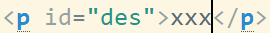

# 笔记
---

## Javascript DOM编程艺术
---
<pre>
    >childNodes <code>elment.childNodes:document.body.childNodes</code>
    返回一个数组，这个数组包含给定元素节点的全体子元素。
</pre>
<pre>
    >nodeType <code>node.nodeType:alert(document.body.nodeType)</code>
    返回数字，这个包含给定元素所有类型的节点。
    <code>节点有3种：元素节点、属性节点和文本节点</code>
        元素节点的nodeType属性值为1；
        属性节点的nodeType属性值为2；
        文本节点的nodeType属性值为3。
</pre>
<pre>
    >nodeValue <code>node.nodeValue</code>
    改变某个文本节点的值。

    例如：
    
    var des=document.getElementById('des');
    alert(des.nodeValue); //null。
    原因：p元素的属性节点是一个空值，而我们需要的是p元素的文本节点。换句话说，如果想要获取p元素的文本节点，就必须检索它的第一个子节点的nodeValue属性值。
    下面这条alert可以找到我们想要的内容：
    alert(des.childNodes[0].nodeValue);

    <code>childNodes[0]==firstChild;</code>
    <code>childNodes[li.length-1]==lastChild;</code>
</pre>
<pre>
    function addLoadEvent(func){
        if(typeof window.onload != 'function'){
            window.onload=func;
        }else{
            window.onload=function(){
                oldonload();
                func();
            }
        }
    }
</pre>
<pre>
    总结：
    　　1. window.onload=function(){}是等待所有的内容都加载完之后执行，比如图片，内容，js，css等。
    　　2. $(function(){})，是等待DOM加载完之后执行（我的理解是标签绘制完毕之后），图片未加载完时也能执行。
    　　3. $(function(){})是$(document).ready(function(){})的简写方式，功能是一样的。
    　　4. $(window).load(function (){})也是等待所有的内容都加载完之后执行。
    　　5. 不管是外链js还是页面中的js的window.onload都只执行最后的一个
    　　6. $(window).load(function (){})可以有多个，而且都是顺序执行。

    扩展：
    如果要js实现多个window.onload的方式
    1.在body中调用多个函数
    <body onload="f1();f2();f3();"></body>
    这种方式和下面这种方式是一样的。
    function f1(){...}
    function f2(){...}
    window.onload=function(){
        f1();
        f2();
    }　　
    显然，这种方式不太可取。毕竟不能把所有页面的function都聚在一堆。

    2. 判断window.onload是否已经执行了一次，如果是的话，就把原来执行的window.onload函数按照方式1来处理。这样就不会覆盖了
    function f1(){...}
    function f2(){...}
    function moreLoad(fn) {
        var winLoad = window.onload;
        if (typeof window.onload != 'function') {
            window.onload = fn;
        } else {
            window.onload = function() {
                winLoad ();
                fn();
            }
        }
    }
    moreLoad(f1)
    moreLoad(f2)

    3. 采用事件监听，ie8以及ie8以下为attachEvent，其它的为addEventListener。这样也不会覆盖
    function f3(){alert("f3")}
    function f4(){alert("f4")}
    function win_load(callBack){
        if (window.attachEvent) {
            window.attachEvent("onload", callBack);
        } else if (window.addEventListener) {
            window.addEventListener("load", callBack);
        }
    }
    win_load(f3)
    win_load(f4)
    
    注意：
    　　1.attachEvent的第二个参数，需要在事件前面加“on”，所以这里加载事件是onload  。而addEventListener第二个参数不用再事件前面加“on”，所以这里是load；本来还有第三个参数，可选，表示指定事件是否在捕获或冒泡阶段执行。默认为false，所以这里就不用写上去。
    　　2. ie的attachEvent里面绑定多个事件的执行顺序是不一样的，如上面的例子，IE中是先执行f4函数，再执行f3函数，倒着执行的。而addEventListener是正常的。
    　　3. 最后说一下加载顺序：假如我在当前页面引入了两个js文件，一个a.js  一个b.js，分别都有window.onload，$(function(){})， $(window).load(function (){})

    执行的顺序是：
    　　1. 先以a.js,b.js的顺序执行a.js中未包含在window.onload与$(function(){})和$(window).load(function (){})中的代码。
    　　2. 然后再执行$(function(){})里面的代码，
    　　3. 然后以a.js,b.js的顺序，执行$(window).load(function (){})里面的代码，
    　　4. 最后执行最后一个js中window.onload里面的代码 
    　　但是！！！在火狐和IE浏览器中，window.onload的执行顺序要高于$(window).load(function (){})，其它浏览器的加载顺序都是一样的。这个我就理解不了了。。。。。。
</pre>
<pre>
    >innerHTML、createElement、createTextNode、appendChild、insertBefore
    createElement、createTextNode、appendChild：parent.appendChild(child)。
    createElement：创建一个元素节点。
    createTextNode：创建一个文本节点。
    
    var des=document.getElementById('des');
    var para=document.createElement('em');
    var txt=document.createTextNode('我是斜体字');
    des.appendChild(para);

    insertBefore：将一个新元素插入到一个现有元素的前面。parentElement.insertBefore(newElement,targetElement)。 

    由于DOM并没有提供insertAfter()方法，所以可以自己编写insertAfter，如下：
    function insertAfter(newElement,targetElement){
        var parent=targetElement.parentNode;
        if(parent.lastChild==targetElement){
            parent.appentChild(newElement);
        }else{
            parent.insertBefore(newElement,targetElement.nextSibling)
        }
    }

    targetElement.nextSibling:目标元素的下一个兄弟节点。
</pre>
<pre>
    function addClass(element,value){
        if(!element.className){
            element.className=value;
        }else{
            var newClassName=element.className;
            newClassName='';
            newClassName+=value;
            element.className=newClassName;
        }
    }

    function getNextElement(node){
        if(node.nodeType==1) { return node; }
        if(node.nextSibling) { return getNextElement(node.nextSibling); }
        return null;
    }

    function styleHeaderSiblings(tag,theClass){
        if(!document.getElementsByTagName) return false;
        var headers=document.getElementsByTagName(tag);
        for(var i=0;i< headers.length;i++){
            var elem=getNextElement(headers[i].nextSibling);
            addClass(elem,theClass);
        }
    }
</pre>
<pre>
    function highlightPage() {
        if (!document.getElementsByName || !document.getElementById || !document.getElementById('nav')) {
            return false;
        }

        var nav=document.getElementById('nav');
        var links=document.getElementsByTagName('a');

        for (var i = 0; i < links.length; i++) {
            var link_url=links[i].getAttribute('herf');
            var cur_url =window.location.href;
            if (cur_url.indexOf(link_url)!=-1) {
                links[i].className='active';
                var link_text=links[i].lastChild.nodeValue.toLowerCase();
                document.body.id=link_text;
            }

        }
    }
</pre>
<pre>
    //表单，点击label标签，让输入框获取焦点
    function focusLabels() {
        if (!document.getElementsByName) return false;
        var labels=document.getElementsByTagName('label');
        for (var i = 0; i < labels.length; i++) {
            if (!labels[i].getAttribute('for')) continue;
            labels[i].onclick=function () {
                var id=this.getAttribute('for');
                if(!document.getElementById(id)) return false;
                var element=document.getElementById(id);
                element.focus();
            }
        }
    }

    function resetFields(whichform) {
      for (var i=0; i< whichform.elements.length; i++) {
        var element = whichform.elements[i];
        if (element.type == "submit") continue;
        if (!element.defaultValue) continue;
        element.onfocus = function() {
        if (this.value == this.defaultValue) {
          this.value = "";
         }
        }
        element.onblur = function() {
          if (this.value == "") {
            this.value = this.defaultValue;
          }
        }
      }
    }

    function validateForm(whichform) {
      for (var i=0; i< whichform.elements.length; i++) {
        var element = whichform.elements[i];
        if (element.className.indexOf("required") != -1) {
          if (!isFilled(element)) {
            alert("Please fill in the "+element.name+" field.");
            return false;
          }
        }
        if (element.className.indexOf("email") != -1) {
          if (!isEmail(element)) {
            alert("The "+element.name+" field must be a valid email address.");
            return false;
          }
        }
      }
      return true;
    }

    function isFilled(field) {
      if (field.value.length < 1 || field.value == field.defaultValue) {
        return false;
      } else {
        return true;
      }
    }

    function isEmail(field) {
      if (field.value.indexOf("@") == -1 || field.value.indexOf(".") == -1) {
        return false;
      } else {
        return true;
      }
    }

    function prepareForms() {
      for (var i=0; i< document.forms.length; i++) {
        var thisform = document.forms[i];
        resetFields(thisform);
        thisform.onsubmit = function() {
          return validateForm(this);
        }
      }
    }

    Javascript DOM编程艺术--网站设计实战：https://domscripting.com/domsters/index.html
</pre>

## JavaScript权威指南
<code>示例代码：http://oreilly.com/catalog/9780596805531</code>

## JavaScript忍者秘籍
<pre>
    测试框架：QUnit、YUI Test、JsUnit、Jasmine、TestSwarn
    http://qunitjs.com
    http://developer.yahoo.com/yui/3/test
    http://pivotallabs.com/what/mobile/overview     https://github.com/jasmine/jasmine/wiki
    https://github.com/jquery/testswarn/wiki
</pre>

## Javascript高级程序设计
<pre>
    运用于放过和屏蔽任何输入文本框的字符。
    EventUtil.addHandler(textbox, "keypress", function(event){ 
        event = EventUtil.getEvent(event); 
        var target = EventUtil.getTarget(event); 
        var charCode = EventUtil.getCharCode(event); 
        if (!/\d/.test(String.fromCharCode(charCode)) && charCode > 9 && !event.ctrlKey){ 
            EventUtil.preventDefault(event); 
        } 
    }); 
</pre>

